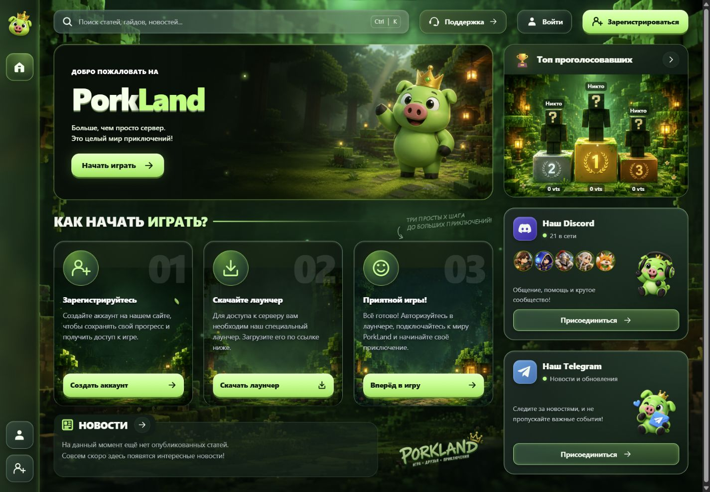
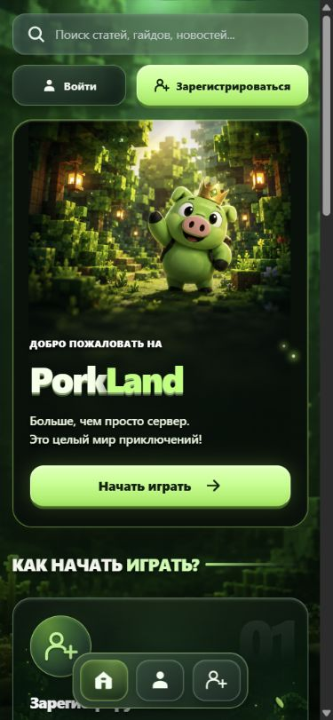
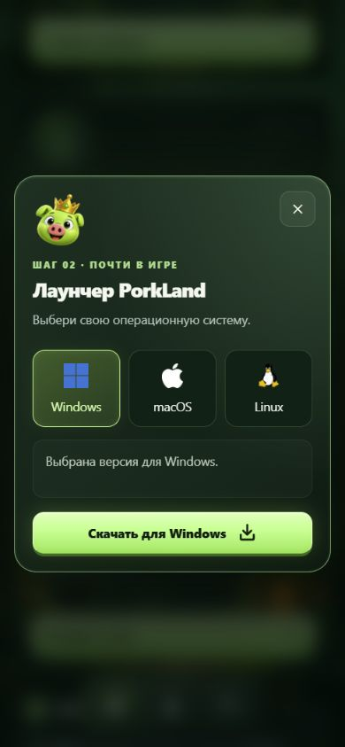

# PorkLand

Игровой сайт с адаптивной вёрсткой, зелёным маскотом и атмосферой воксельного леса.

**[Открыть сайт →](https://serezjjja.github.io/porkland-website/)**

## Задача

Создать выразительную главную страницу игрового сообщества: познакомить посетителя с проектом, показать шаги начала игры и собрать основные действия в одном интерфейсе.

## Решение

- Главный баннер с отдельной мобильной композицией.
- Три карточки: регистрация, установка лаунчера и начало игры.
- Выбор Windows, macOS и Linux в окне лаунчера.
- Поиск по разделам с клавиатурной навигацией.
- Диалоги регистрации, входа, поддержки и рейтинга.
- Карточки Discord и Telegram, блок новостей.
- Адаптивная сетка, плавные эффекты и поддержка отключения анимаций.

## На телефоне

<table>
  <tr>
    <td></td>
    <td></td>
  </tr>
</table>

## Технологии

Astro, JavaScript, HTML, CSS Grid и Flexbox. Статическая сборка опубликована на GitHub Pages.

В этом репозитории представлены готовый сайт и скриншоты. Исходный проект хранится отдельно. Реализована клиентская часть; серверная авторизация и игровые сервисы не подключены.

[Источники логотипов платформ](docs/platform-icons-sources.md).

[Serezjjja](https://github.com/Serezjjja)
